# 🚀 Prakash Raj | AI × Web Developer

<div align="center">

  


</div>


## 🎯 What I Do

<div align="center">

```ascii
╭─────────────────────────────────────────────────────────────╮
│  🤖 AI & Machine Learning    🌐 Full Stack Development      │
│  📊 Data Science & Analysis  🎨 UI/UX Design               │
│  🚀 EdTech Solutions        🔧 Open Source Contributions   │
╰─────────────────────────────────────────────────────────────╯
```

</div>

---

## 🛠️ Tech Arsenal

<div align="center">

### Languages & Frameworks


### Design & Styling


### Data & AI


</div>

---

## 🎨 Featured Projects

<div align="center">

<table>
<tr>
<td width="50%">

### 🎮 abcdkbd
**Interactive Learning Platform for Kids**
- 🌍 Multilingual support with animated games
- 🎵 Audio feedback and touch interactions
- 🎨 SVG-powered beautiful UI
- 📱 Mobile-responsive design

```javascript
const learningMagic = () => {
  return "Education + Fun = Success! 🚀"
}
```

[🔗 View Project](https://github.com/1046prt/abcdkbd)

</td>
<td width="50%">

### 📈 StockScope
**Real-time Stock Analysis Dashboard**
- ⚡ Lightning-fast static site
- 📊 Interactive SVG charts
- 💹 20+ stock tickers tracked
- 🔄 Real-time data updates

```python
def analyze_stocks():
    return "Data + Insights = Profit! 💰"
```

[🔗 View Project](https://github.com/1046prt/StockScope)

</td>
</tr>
<tr>
<td width="50%">

### 🎓 EduForm
**Modern Course Registration System**
- 🌙 Dark/Light theme toggle
- 📱 Responsive design
- 🎨 Custom SVG icons
- ⚡ Fast form processing

```css
.modern-design {
  beauty: "maximum";
  functionality: "optimal";
}
```

[🔗 View Project](https://github.com/1046prt/EduForm)

</td>
<td width="50%">

### 🛡️ AI Spam Detector
**Intelligent Email Filtering**
- 🤖 Machine learning powered
- 📊 Live prediction visualization
- 🎯 99%+ accuracy rate
- 📈 Real-time performance graphs

```python
if email == "spam":
    return "🚫 Blocked!"
else:
    return "✅ Safe to read!"
```

[🔗 View Project](https://github.com/1046prt/spam-detector)

</td>
</tr>
</table>

</div>

---

## 📊 GitHub Analytics

<div align="center">


</div>

---

## 🎯 Current Focus

```mermaid
graph TD
    A[🎯 Current Goals] --> B[🤖 AI in Education]
    A --> C[🌐 Web3 Integration]  
    A --> D[📱 Mobile Apps]
    A --> E[🚀 Open Source]
    
    B --> F[Smart Tutoring Systems]
    C --> G[Decentralized Learning]
    D --> H[Cross-platform Tools]
    E --> I[Community Building]
    
    style A fill:#00d9ff,stroke:#333,stroke-width:3px,color:#000
    style B fill:#ff6b6b,stroke:#333,stroke-width:2px,color:#fff
    style C fill:#4ecdc4,stroke:#333,stroke-width:2px,color:#fff
    style D fill:#ffe66d,stroke:#333,stroke-width:2px,color:#000
    style E fill:#a8e6cf,stroke:#333,stroke-width:2px,color:#000
```

<div align="center">



</div>

---

## 🎨 Design Philosophy

<div align="center">

> *"Great design is not just what it looks like and feels like. Great design is how it works."*
> 
> **— Steve Jobs**

**My Design Principles:**
- 🎯 **User-Centric**: Every pixel serves a purpose
- 🌈 **Vibrant**: Bold colors that inspire action
- ⚡ **Fast**: Performance is a feature, not an afterthought
- 🔄 **Interactive**: Static is boring, motion tells stories
- 🌙 **Adaptive**: Dark mode isn't optional, it's essential

</div>

---

## 🎵 Coding Playlist

<div align="center">

```
🎵 Currently Coding To:
┌─────────────────────────────────────┐
│ ♫ Synthwave Mix 2024               │
│ ♫ Lo-fi Hip Hop Beats              │
│ ♫ Cyberpunk Ambient                │
│ ♫ Focus Deep Work Playlist         │
└─────────────────────────────────────┘
```

</div>

---

## 🤝 Let's Connect & Collaborate

<div align="center">

[](https://www.linkedin.com/in/prakash-raj-dev)
[](https://prakashraj.dev)
[](https://twitter.com/prakashraj_dev)
[](mailto:prakash@example.com)

### 💬 Let's Build Something Amazing Together!

**Open to:**
- 🚀 Freelance Projects
- 🤝 Collaborations
- 🎯 Hackathons
- 💡 Innovative Ideas
- 🌟 Open Source Contributions

</div>

---

<div align="center">

## 🟩 Contribution Graph

<div align="center">

<a href="https://github.com/ashutosh00710/github-readme-activity-graph">
  
</a>

</div>

### 🎯 Fun Facts About Me

```javascript
const prakashRaj = {
    code: ["JavaScript", "Python", "TypeScript", "CSS"],
    loves: ["Coffee ☕", "Dark Mode 🌙", "Clean Code 🧹", "Gaming 🎮"],
    currentlyLearning: "WebAssembly & Rust 🦀",
    funFact: "I debug with console.log() and I'm not ashamed! 😄",
    motto: "Code with passion, design with purpose! 🚀"
};
```


### 🎨 Profile Stats


---

**⭐ ~ From [1046prt](https://github.com/1046prt) **

*"In a world full of code, be the comment that makes sense!"* 🌟

</div>
